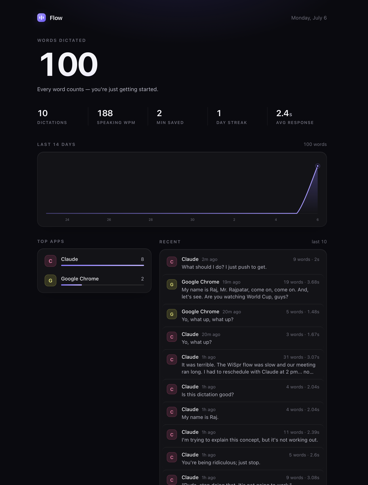

# Flow Clone — local voice dictation for macOS

A free, local, privacy-first clone of [Wispr Flow](https://wisprflow.ai): hold a key, speak, release — clean formatted text appears in whatever app has focus. Runs permanently in your menu bar. Audio never leaves your machine unless you opt into a cloud formatter.



## Features (Wispr parity, all free)

- **Hold-to-talk anywhere** — hold **right Option (⌥)**, speak, release. Works in every app.
- **Local transcription** — [faster-whisper](https://github.com/SYSTRAN/faster-whisper) `small.en`, native arm64, ~6× realtime on Apple Silicon (a 5 s dictation lands in <1 s).
- **Voice-reactive HUD** — Wispr-style black pill above the Dock; waveform bars follow your actual voice.
- **Per-app tone** — casual in Slack/Messages/Discord, verbatim (no invented punctuation) in terminals/IDEs, clean prose everywhere else.
- **Personal dictionary** — `~/.flowclone_dict.json`: your names/jargon bias recognition; forced replacements fix stubborn mishears.
- **Snippets** — say "insert my email" → your saved text expands.
- **Spoken commands** — "new line", "new paragraph", "period", "comma", "question mark"…, and **"scratch that"** discards what you said before it.
- **Whisper-quiet mode** — auto-gain normalizes quiet speech; dictate without disturbing the room.
- **Auto-edits** — filler-word removal + punctuation locally; optional LLM cleanup (self-correction collapse, tone rewriting) via free local [Ollama](https://ollama.com) or Claude API.
- **History** — menu bar → History: last 20 dictations, click to re-copy.
- **Sound cues** + always-on via LaunchAgent (starts at login, auto-restarts).

## Architecture

```
hold ⌥ ─▶ hotkey.py ─▶ audio.py ─▶ transcriber.py ─▶ dictionary.py ─▶ formatter.py ─▶ injector.py ─▶ paste
          pynput       mic+RMS      faster-whisper     vocab/snippets    commands/tone     CGEvent ⌘V
          listener     auto-gain    small.en int8      replacements      regex or LLM      clipboard swap
                                         ▲                                    ▲
                              initial_prompt bias                   context.py (frontmost app → tone)
```

Three threads: pynput listener (key events), worker (transcribe→paste), main (rumps menu bar + HUD + sounds — all AppKit stays here, fed by a 20 fps timer).

## Setup

```bash
cd wispr-flow-clone
uv venv .venv --python 3.12        # MUST be native arm64 python (not Rosetta!)
uv pip install -r requirements.txt --python .venv/bin/python
PYTHONPATH=src .venv/bin/python -m flow
```

### Permissions (System Settings → Privacy & Security)
Grant the **actual python binary** (it self-registers in the panes on first run; permissions are per-binary — swapping interpreters resets them):
- **Accessibility** — paste keystrokes • **Input Monitoring** — hotkey • **Microphone** — recording

The app prints `permissions OK` or exactly what's missing to its log.

### Always-on (LaunchAgent)
Installed at `~/Library/LaunchAgents/com.rajpatel.flowclone.plist`. Logs: `~/Library/Logs/flowclone.log`.
```bash
launchctl kickstart -k gui/501/com.rajpatel.flowclone   # restart (after code/config changes)
launchctl bootout gui/501/com.rajpatel.flowclone        # stop permanently
```

### Optional LLM formatter (better auto-edits, still free)
Install [Ollama](https://ollama.com/download) → `ollama pull llama3.2` → set `"formatter": "ollama"` in `~/.flowclone.json` → kickstart. Falls back to regex cleanup automatically if Ollama is down.

## Config

`~/.flowclone.json`: `model_size`, `hotkey` (pynput name; Fn is impossible on macOS), `formatter` (`none|ollama|claude`), `restore_clipboard`.
`~/.flowclone_dict.json`: `words` (recognition bias), `replacements`, `snippets`.

## Development

[CLAUDE.md](CLAUDE.md) conventions • [PLAN.md](PLAN.md) roadmap • `.claude/agents/` subagents • `.claude/skills/` skills • `PYTHONPATH=src .venv/bin/python -m pytest tests/ -q`
